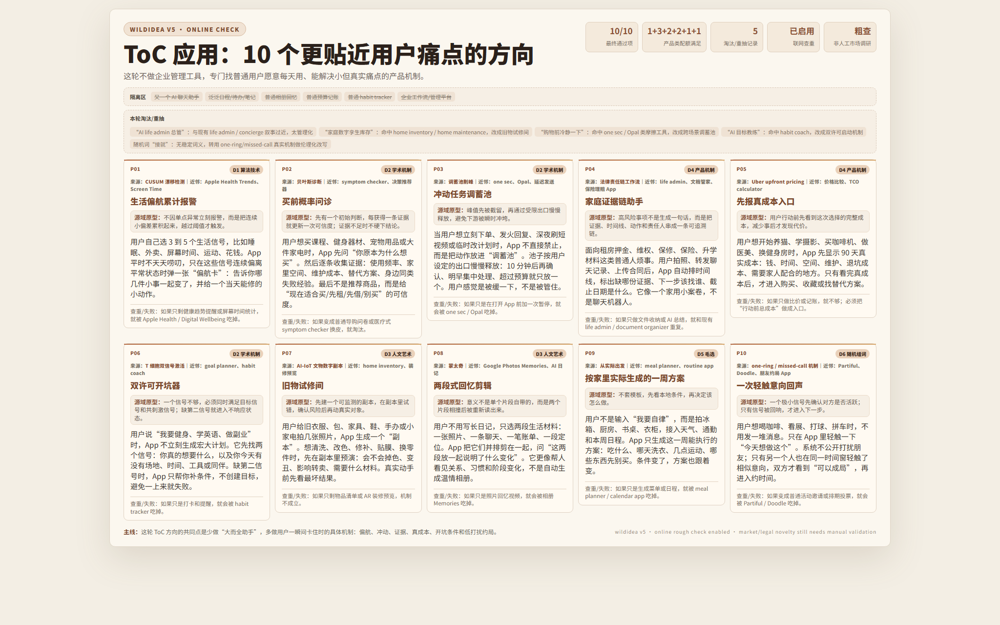

# WildIdea V5

WildIdea 是一个用于产品、策略、研究和算法创新发散的 Agent skill。

它的核心目标不是让模型先理解问题、再找跨域类比，而是先抽取外部领域里的具体机制，再把这些机制并放到用户领域里的具体对象上。这样可以减少“大路货答案”和“先想好答案再包装”的问题。

## 结果示例



## 使用方式

一键安装：在支持 skill 的 Agent 或 AI 编程环境里，直接输入下面这句话：

`安装这个 skill：https://github.com/liwenyu2002/wildidea`

安装后直接用自然语言提问，不需要手动运行脚本。下面示例用 `$wildidea` 触发；如果你的 Agent 使用不同的 skill 调用方式，按对应格式调用即可。

常见问法：

- `用 $wildidea 帮我为一个相册 App 找 10 个非常规方向`
- `用 $wildidea 给 EEG domain adaptation 任务找创新方法`
- `用 $wildidea 给人工智能与基因组学深度融合找方向`
- `用 $wildidea 用我提供的文献集做严格查重，给多组学问题找方向`
- `用 $wildidea 重跑上一题，把上一轮结果都 ban 掉`
- `用 $wildidea 再野一点，产品方向不要偏管理工程，尽量是 ToC 应用场景`
- `用 $wildidea 快速给我 3 个方向，不要 HTML`

标准模式默认会联网搜索、查重并生成 HTML。只有明确说“不要 HTML/只要文字”时才会跳过 HTML。

## 核心机制

运行路径：

```text
输入 -> 判断问题类型 -> 按槽位抽远域钉子 -> 找用户领域对应物 -> 过滤 -> 重抽 -> 输出10条通过项 -> 生成横版自由窗口HTML
```

WildIdea 只做三件事：

- 收集陌生来源。
- 找外域锚点。
- 并放用户领域对应物。

它明确禁止：

- 先提炼用户问题的“本质”。
- 把远域降级成比喻或启发。
- 在外域锚点和用户领域对应物之间写空泛推导。

## 问题类型与配额

标准模式输出 10 条候选，默认强制联网搜索和查重，并生成一个横版自由窗口 HTML 海报。算法/科研类默认强制在线论文粗查。

| 问题类型 | 槽位配额 |
|----------|----------|
| 算法/科研类 | D1 算法技术 5 条 + D2 学术机制 2 条 + D3 人文艺术 1 条 + 毛选 1 条 + 随机组词 1 条 |
| 产品/策略类 | D1 算法技术 1 条 + D2 学术机制 3 条 + D3 人文艺术 2 条 + D4 产品机制 2 条 + 毛选 1 条 + 随机组词 1 条 |

## 目录结构

```text
wildidea/
├── SKILL.md
├── agents/
│   └── openai.yaml
├── assets/
│   └── readme-result-example.png
├── references/
│   ├── common-chinese-chars.txt
│   ├── domains.json
│   ├── mechanism-transfer.md
│   ├── output-innovation-recipes.md
│   ├── poster-guide.md
│   ├── poster-palettes.md
│   └── search-integration.md
├── scripts/
│   ├── pick_domain_slots.py
│   ├── pick_seed.py
│   ├── search_char.py
│   ├── search_helper.py
│   ├── validate_poster.py
│   └── validate_search.py
└── templates/
    └── poster.html
```

说明：

- `SKILL.md` 是主流程。
- `references/domains.json` 是外部领域锚点库（D1–D4 + MAO 毛选），每条带稳定 id，可在不改代码的前提下扩充。
- `scripts/pick_domain_slots.py` 从 `references/domains.json` 按问题类型随机抽取 10 个锚点（分布在 D1–D4、MAO、RANDOM_WORD 等槽位），只返回抽样 JSON，避免每次调用把完整领域库塞进上下文；支持 `--reroll` 重抽单槽位和 `--exclude` 防重抽。
- `scripts/pick_seed.py` 从 `references/domains.json` 的 MAO 池读取毛选种子，供 `pick_domain_slots.py` 的毛选槽位使用。
- `scripts/search_char.py` 从 `references/common-chinese-chars.txt` 随机抽取两个汉字生成待搜索词，供随机组词槽位使用。
- `references/mechanism-transfer.md` 用于算法/科研类问题，包含源域优先、去锚点退化、最近邻审查、最强反驳等规则。
- `references/poster-guide.md` 和 `templates/poster.html` 用于生成横版自由窗口白底米黄 HTML 海报。
- `scripts/validate_poster.py` 是校验脚本：检查 HTML 结构、卡片字段、去锚点禁词（NFKC+大小写归一+跨语言同义词展开）、proto-desc 相似度（马后炮检测）、干预动词多样性、搜索证据 sidecar 完整性。
- `scripts/search_helper.py` 是联网搜索辅助脚本：用搜狗引擎（零 API key，urllib + curl 双保险），供随机组词和联网验证使用。
- `scripts/validate_search.py` 是搜索证据 sidecar 的独立校验器。
- `outputs/` 是本地生成物目录，已在 `.gitignore` 中忽略，不作为 skill 内容提交。

## 默认 HTML 输出

每次标准模式都会生成横版 HTML，用户不需要额外说“生成 HTML”。只有用户明确说“不要 HTML/只要文本”时才跳过。生成时使用：

- `templates/poster.html`
- `references/poster-guide.md`
- `references/poster-palettes.md`

默认风格是横版自由窗口、白底米黄、Claude 式低对比卡片，写入 `outputs/<topic>.html`。卡片结构固定包含：

- 远域类别
- 具体来源机制
- 源域原型 / 外域抽象结果
- 候选机制名
- 用户领域怎么干（通俗展开）
- 失败条件

每次输出还必须包含本轮淘汰/重抽记录。标准模式查重状态默认是 `联网粗查已启用`；用户提供 BibTeX、DOI、Zotero、标题摘要 CSV 或 PDF 文件夹时，升级为 `文献集严格查重已启用`。联网粗查不能写成文献级原创证明。

## License

MIT
