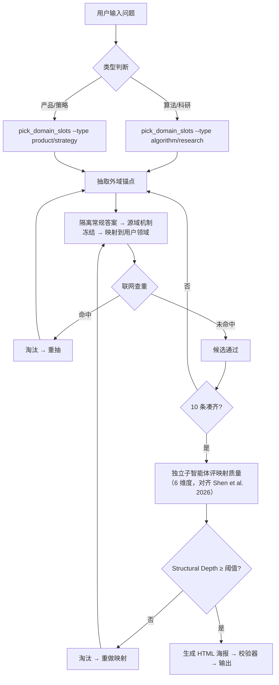

# WildIdea

> 做过创新发散的人都知道，问 AI "帮我找几个新方向"，十有八九会得到一堆**翻来覆去都差不多**的答案——换了个名字的反射机制，换了个说法的注意力加权。问题出在哪？不是 AI 不聪明，而是**它太擅长理解你的问题了**，一旦"理解"了，就会往自己熟悉的区域滑。

WildIdea 干的事情很简单：**不让模型理解你的问题**。

它从一整套外部领域库里随机抽取具体机制——CTC 的 blank 折叠、保险免赔额、防火分区、毛选里的"敌进我退"——然后把这些机制硬放到你的问题上。不解释、不翻译、不推导，直接映射。

你可能会觉得这很暴力，但试下来效果还不错——外域机制是硬塞的，反而逼着你跳出行业惯性，不会往"本来该怎么做"上滑；而且来源都是具体的机制和论文，不是空泛比喻，拿过来就能想出实施画面。在这个skill早期版本实现的几天后，碰巧看到 Shen et al. 2026 年的一篇论文 (*Unlocking LLM Creativity in Science through Analogical Reasoning*)，发现他们居然也用类似的外域映射思路也跑出了 >50% 的新颖率，算是给我补了理论支撑，可见英雄所见略同。于是又参考他们的结构化映射和搜索约束做了进一步优化——特别是去掉了他们"需要先提取问题结构"的步骤，直接从外域端随机映射，加上了自动化校验和去锚点纪律。

## 它长什么样

一次运行会给你 **10 个候选方向**，每个带：
- 一个**具体来源机制**（不是空泛的比喻）
- 一段**通俗的"怎么做"**（你能立刻想象实施画面）
- 一个**失败条件**（什么情况下这个方向不成立）

全部输出成一张横版 HTML 海报——白底米黄、低对比卡片、双击就能看。发到手机上直接跳转浏览器直接打开。

## 怎么用

装到 Claude Code / 支持 skill 的 Agent 里：

```
安装这个 skill：https://github.com/liwenyu2002/wildidea
```

然后直接说话：

```
用 $wildidea 给我的 EEG 情绪识别任务找 10 个方向
```

```
用 $wildidea 给相册 App 找非常规设计思路
```

```
用 $wildidea 重跑上一题，把上一轮结果全 ban 掉
```

```
用 $wildidea 再野一点，不要偏管理方向，给我 ToC 应用场景
```

## 凭什么不会给你翻来覆去的答案

两道硬门槛：

**1. 不理解问题。** WildIdea 不会先"分析"你的问题再找类比。它跳过理解、直接映射——外域的机制结构是什么，就原样放上来，不允许在中间写推导过程。

**2. 不允许空泛。** 每条候选必须有可指认的具体来源（论文、产品、标准）、必须有明确的阈值或边界条件、去掉外域机制后如果只剩行业常识就直接淘汰。校验器会机械执行这些规则——不是靠模型自觉。

## 怎么工作的



- **领域库**：388 条锚点（D1 算法技术 210 + D2 学术 49 + D3 人文艺术 44 + D4 产品 35 + 毛选 50），其中 180 条直接参考论文 AR Dataset。
- **随机组词**：每轮抽一个随机词去搜狗搜，从搜索结果里撞出意料之外的方法论——词越没意义，结果越不可预期
- **联网查重**：标准模式默认联网，搜到已有同名方法直接 ban 掉
- **校验器**：机械执行去锚点纪律（NFKC + 大小写归一 + 中英文同义词展开）、proto-desc 相似度检测（防马后炮）、干预动词多样性检查
- **映射质量评分**：独立子智能体按 Shen et al. 2026 的 6 维度评分（Structural Depth / Domain Distance / Applicability / Novelty / Unexpectedness / Non-Obviousness），低于阈值直接淘汰

## 项目结构

不用细看目录树——核心就这几样东西：

| 干嘛的 | 文件 |
|--------|------|
| 主流程 | `SKILL.md` |
| 领域库（388 条锚点 + 方法库） | `references/domains.json` |
| 抽槽位脚本 | `scripts/pick_domain_slots.py` |
| 搜索辅助 | `scripts/search_helper.py` |
| HTML 海报校验 | `scripts/validate_poster.py` |

其余 `references/` 下的 `.md` 是校验规则、海报样式等参考文档，模型在运行时按需读取。

## License

MIT
