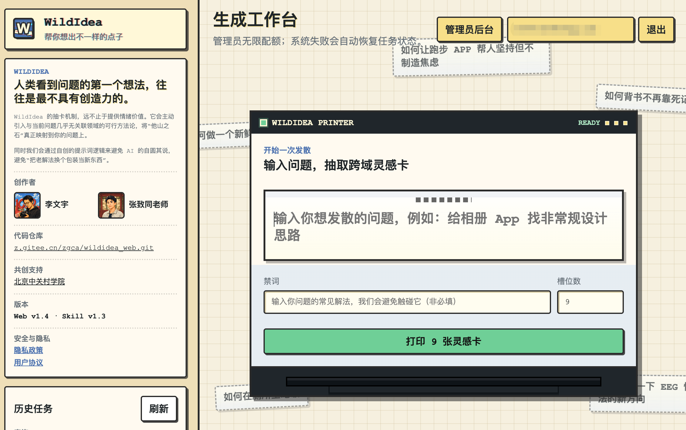

<div align="center">

# WildIdea Skill

[](./skill/wildidea/SKILL.md)
[](https://wildidea.wenyuli.site)
[](./LICENSE)

[简体中文](./README.md) | [English](./README_EN.md)

**Inject distant-domain mechanisms into the problem space to generate farther, more concrete ideas.**

WildIdea is a standalone ideation skill for cross-domain thinking across product, strategy, research, algorithm, and design problems.

</div>

## Introduction

The first idea people see when facing a problem is often the least creative one.

WildIdea does not brainstorm inside the user's familiar problem frame. It first draws a source phenomenon from a distant-domain card pool, freezes it as "他山之石", abstracts the transferable method, and then maps that method back to the user's problem. This interrupts habitual answers and reduces the chance of repackaging old solutions as new ones.

## Web Version

WildIdea now has a web version: [wildidea.wenyuli.site](https://wildidea.wenyuli.site). Use it directly in the browser to draw, save, and share cross-domain idea cards without installing the local skill. New users receive 30 idea cards after registration.

<p align="center">
  <a href="https://wildidea.wenyuli.site">
    
  </a>
</p>

## Core Capabilities

| Capability | Description |
|---|---|
| Distant-domain draw | Samples mechanisms from algorithm, academic, humanities/art, product, Mao-style, and random-word pools |
| Source-first reasoning | Shows the source phenomenon before abstracting the transferable method |
| Web search helper | Includes a zero-key search helper for random-word grounding and basic novelty checks (Skill path only; the web app's novelty score is an AI-judge self-assessment without live web dedup) |
| Quality filtering | Constrains structural depth, domain distance, novelty, and applicability; weak candidates can be redrawn |
| Standalone use | Download `skill/wildidea/` and use it directly without running extra services |

## Quick Start

Paste the instruction below into your agent and send it. The agent will install this skill automatically:

```bash
curl -fsSL https://raw.githubusercontent.com/liwenyu2002/wildidea/main/scripts/install.sh | bash
```

After installation, you can say to your agent:

```text
Use wildidea to help me answer: how should I design a photo album app?
```

## Workflow

1. Input the problem and common solutions to avoid.
2. Draw source mechanisms from distant-domain card pools.
3. Identify the concrete source phenomenon.
4. Abstract a transferable method without target-domain terms.
5. Map the method back to the user's problem.
6. Filter or redraw weak candidates.
7. Return concrete idea cards.

## What Is Included

| Path | Purpose |
|---|---|
| `skill/wildidea/SKILL.md` | Skill entrypoint |
| `skill/wildidea/references/wildidea-skill.md` | Full workflow spec |
| `skill/wildidea/references/domains.json` | Card pool data |
| `skill/wildidea/scripts/search_helper.py` | Zero-key web search helper |
| `skill/wildidea/scripts/pick_domain_slots.py` | Slot sampler |
| `skill/wildidea/templates/poster.html` | Optional poster template |
| `scripts/install.sh` | One-command installer |

## Local Validation

```bash
python3 /path/to/skill-creator/scripts/quick_validate.py skill/wildidea
```

## License

MIT
